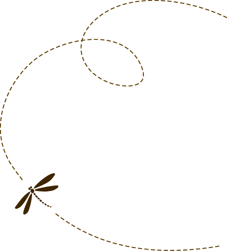

Vi satsar på böcker vi själva går igång på - svart humor, berörande relationer, vackert språk och modiga berättelser som klassas som romaner, men inte nödvändigtvis tillhör en viss begränsad genre.

- Böcker som vi ger ut ska alltid ha ett budskap och väcka eftertanke.
- Böcker som känns och inte fogar sig.
- Böcker man vill stryka under i, citera och återkomma till.

# Hur vi tänker… 

Nitwit Förlag har vuxit fram ur kärleken till skrivandet, hantverket, litteraturen och
allt som orden kan göra med våra liv.

Vi satsar på böcker vi själva går igång på - svart humor, berörande relationer, vackert
språk och modiga berättelser som klassas som romaner, men inte nödvändigtvis tillhör en
viss begränsad genre.

Böcker som vi ger ut ska svida, aldrig foga sig. Böcker man vill stryka under i, citera
och återkomma till. Språket är en lekstuga, bokmarknaden en djungel och vi tror på
litteratur som växer med tiden.

Vi gör som tror blir bäst i varje samarbete och tar avstamp i våra många långa yrkesår
inom skrivande, marknadsföring, IT och entreprenörskap. En mix som kanske inte är
självklar, men som visat sig kunna resultera i förunderliga fyrverkerier. 

# Vår förlagsfilosofi… 

Vi vill syssla med utgivning som inte alltid får plats på den klassiskt kommersiella
marknaden.

Vi tror på ett tätt samarbete med författaren och en rättvis fördelning av arbetet och den
ekonomiska investeringen som krävs för att slutföra ett bokprojekt - från idé till
utgivning. Vi smider planer ihop och växeldrar för att nå ut till läsare.

Vi tror på långsam litteratur med många bottnar och språk som berör.

Till oss kommer man inte för att ge ut bestsellers. Till oss kommer man för att man älskar
skrivandet, litteraturen och vill vara med om hela den process som en bokutgivning
innebär.

Vi ger ut ytterst få titlar och vi gör det för att det är roligt. Samarbetet ska vara
lustfyllt och ömsesidigt och vi står för öppenhet och tydlighet i alla delar av
utgivningsprocessen. Vi kan inte allt, men har ett stort nätverk och sätter alltid
kvaliteten högt.

Vi vet att det är dyrt att ge ut böcker. Hos oss betalar författaren en del av stegen som
krävs för att få till en färdig bok och det kostar. Vi ser själva utgivningsprocessen som
en liten del i bokens liv. Den ska leva länge - och den eventuella förtjänsten som hägrar
vid horisonten tillfaller givetvis till största del författaren. Vi är inte giriga - men
vi kan inte jobba gratis. 

Vi tar oss bara an projekt vi tror på och böcker som känns. När vi ingår ett avtal går vi
all in. Det är vår gemensamma ambition att boken ska må bra där ute, få fina reaktioner
och möta läsare. När boken ges ut har allting bara börjat. 

# Hur vi arbetar...

Vi är inte ett hybridförlag, men inte heller ett fullskaligt traditionellt. Vi tar endast
emot mycket genomarbetade manus som granskats noga av lektör och vars författare delar vår
syn på vad som är kvalitet.

Vi jobbar nära och tillsammans med författaren till tryckfärdigt manus och förmedlar
kontakt med professionell kompetens i vårt nätverk av korrekturläsare, formgivare,
lektörer, ljudboksinläsare och redaktörer. Dessa kontakter sköter författaren själv - och
ja, det är tjänster som författaren själv bekostar. 

Hos oss ser varje förlagsavtal olika ut beroende på förutsättningar och författarens eget
nätverk. Vårt motto är att varje avtal ska vara rättvist och aldrig klaustrofobiskt när
det gäller rättigheter.

Vi står för tryckkostnader, lagring och det praktiska arbetet med att få ut boken i
nätbokhandlarna och streamingtjänsterna för ljudbok. För detta tar vi en mindre del av en
eventuell förtjänst på boken. Resten behåller du som skrivit.

Vi stöttar alltid i marknadsföring genom våra kanaler, men du som skrivit har stort ansvar
för att boken når ut till läsaren. Inställningen behöver vara: det här gör vi gemensamt! 

# När kommer du till oss?

Vi tittar bara på färdiga manus som genomgått minst två lektörsläsningar. Vi läser manuset
och gör den slutgiltiga bedömningen kring om boken lever upp till våra krav och passar i
vår utgivning. Om inte - har vi ofta andra samarbetsvägar att rekommendera för dig. 

När ett samarbete är aktuellt inleder vi alltid med ett fysiskt möte där vi synkar
förväntningar. För oss är det viktigt att vibbarna är rätt och att vi har en samsyn på hur
det gemensamma projektet ska genomföras. 

# Människorna bakom Nitwit Förlag

*Frida Spikdotter Nilsson* - författare, skrivcoach, redaktör och storytellingrådgivare.
Debuterade 2022 med den svarta humor-romanen Efter Morris som blivit en underdogsuccé ute
hos läsarna. Skriver på nästa roman och ett par andra böcker i olika genrer - barn och
kreativa processer. 

[Här kan du läsa mer om mig](https://spikdotter.se/om/) och [ta kontakt via LinkedIn](https://www.linkedin.com/in/fridanilsson/) 
 eller [Instagram](https://www.instagram.com/spikdotter/). 

*Mark Dixon* - konslut och allmän IT expert. Sköter det logistiska och administrativa kring
att driva förlag. 

